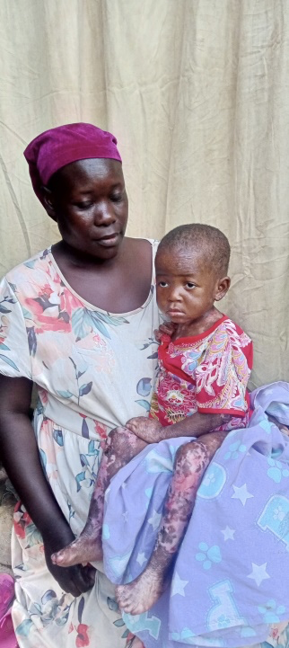
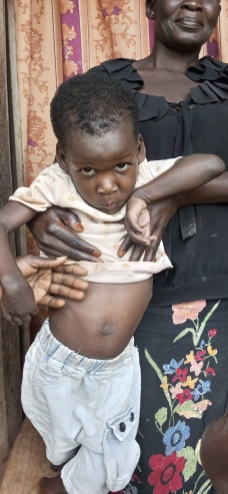
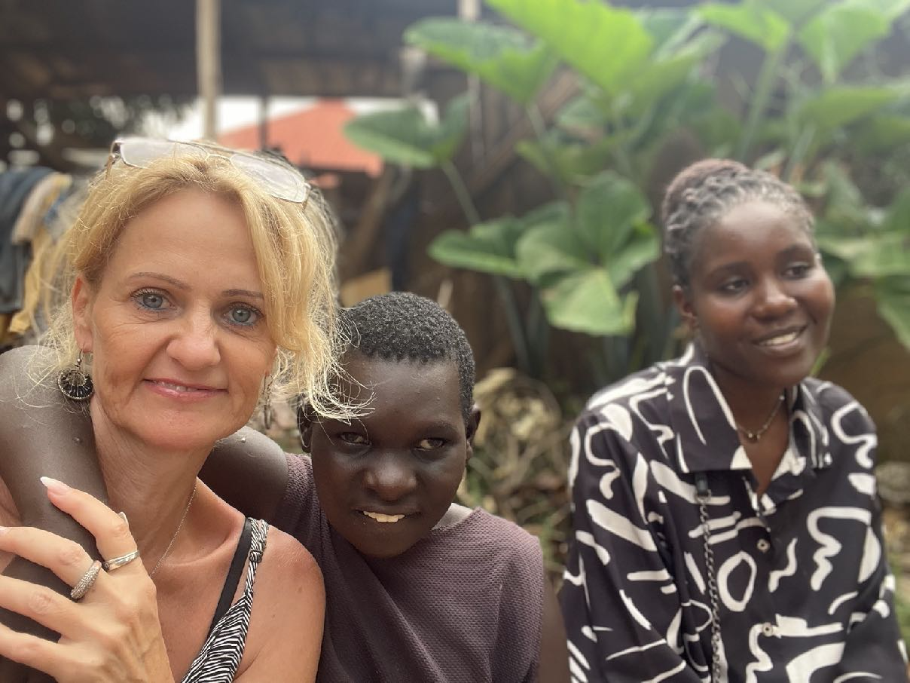
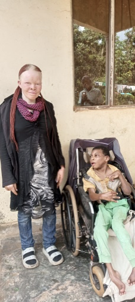
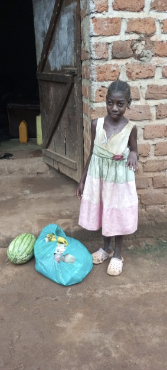
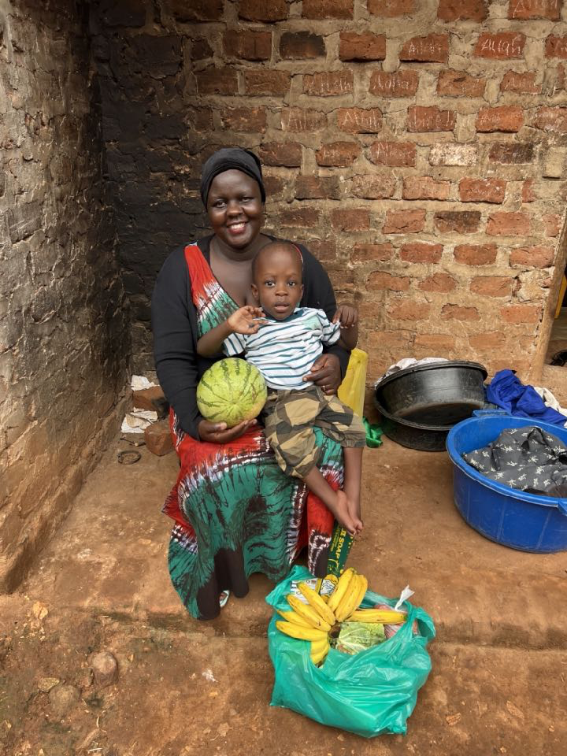

---
---

## Die 9 Familien

### Familie 1: Nakanwagi Lausah

**Geburtsdatum:** 23. August 2021  
**Behinderung:** Epidermolysis Bullosa (Hauterkrankung)  
**Betreuungsperson:** Nangobi Fatumah (leibliche Mutter)  
**Dorf:** Kitete, Mukono-Distrikt  
**Kontakt:** +256 707 429 384

**Ihre Geschichte:**  
Lausah ist ein vierjähriges Mädchen, das bei ihrer leiblichen Mutter lebt und seit ihrer Geburt an einer Hauterkrankung leidet. Der Vater lebt zwar, übernimmt aber keine volle Verantwortung und besucht die Familie nur gelegentlich. Er hat auch eine andere Frau. Lausah hat eine jüngere Schwester vom selben Vater, und ihre Lebensbedingungen sind sehr schwierig. Selbst Medikamente und Nahrungsmittel zu beschaffen ist eine Herausforderung. Die Mutter versucht, die Familie zu unterstützen, indem sie für Menschen in ihrem Dorf und in benachbarten Dörfern Wäsche wäscht, aber das reicht nicht aus.

---

### Familie 2: Lutwama Suubi

**Geburtsdatum:** 22. Februar 2020  
**Behinderung:** Zerebralparese (CP)  
**Betreuungsperson:** Baraka Agnes (leibliche Mutter)  
**Dorf:** Makata, Mukono-Distrikt  
**Kontakt:** +256 752 719 173

**Seine Geschichte:**  
Suubi schrie bei seiner Geburt nicht, weil die Ärzte sagten, er sei erschöpft aufgrund der verzögerten Geburt. Er kann in seinem Alter jetzt weder stehen noch sitzen und muss wie ein Kind mit Zerebralparese gefüttert werden. Er lebt mit seiner Mutter und vier Geschwistern zusammen. Der Vater hat die Familie verlassen und besucht sie etwa einmal im Jahr. Die Mutter hat große Schwierigkeiten, Medikamente, Nahrung und Schulgeld für die anderen Kinder aufzubringen.

---

### Familie 3: Nansubuga Kasiina Maria

**Geburtsdatum:** 23. Mai 2012  
**Behinderung:** Zerebralparese (CP)  
**Betreuungsperson:** Namiika Maria Immaculate (Tante)  
**Dorf:** Ngandu, Mukono-Distrikt  
**Kontakt:** +256 744 589 976 / +256 782 080 877

**Ihre Geschichte:**  
Maria wurde erschöpft geboren und es wurde festgestellt, dass sie Zerebralparese hat. Derzeit lebt sie bei ihrer Tante und Cousine, da beide Elternteile, obwohl sie am Leben sind, nirgendwo zu finden sind. Sie kämpfen darum, Essen und andere Grundbedürfnisse zu bekommen.

---

### Familie 4: Lubwama Sharif

**Geburtsdatum:** 21. Oktober 2013  
**Behinderung:** Zerebralparese (CP)  
**Betreuungsperson:** Nalwoga Agnes Florence (leibliche Mutter)  
**Dorf:** Kitete, Mukono-Distrikt  
**Kontakt:** +256 784 846 069 / +256 759 217 220

**Seine Geschichte:**  
Sharif lebt bei seiner Mutter, die Albino ist. Er wurde normal geboren, aber später bemerkte die Mutter, dass er nicht wie andere Kinder sitzen oder reagieren konnte. Sie brachte ihn ins Krankenhaus und erfuhr, dass er Zerebralparese hat. Sie brachte ihn früher zu verschiedenen Einrichtungen, musste aber aufgrund von Geldmangel aufhören. Der Vater hat sie verlassen, und derzeit leben sie bei Sharifs Großvater zusammen mit Sharifs Bruder. Als Mutter steht sie vor Herausforderungen wie der Beschaffung von Nahrung und anderen Grundbedürfnissen sowie Vaseline für ihre Haut, da sie Albino ist.

---

### Familie 5: Ntambi Yasin

**Geburtsdatum:** 17. Mai 2007  
**Behinderung:** Autismus  
**Betreuungsperson:** Nabukenya Safinah (Großmutter)  
**Dorf:** Kitete, Mukono-Distrikt  
**Kontakt:** +256 772 474 140

**Seine Geschichte:**  
Yasin, der derzeit bei seiner Großmutter lebt, wurde als Frühchen geboren und musste drei Monate lang im Inkubator bleiben. Die Mutter verließ ihn in der Obhut ihrer Großmutter, als er zwei Monate alt war, und ist bis heute nicht zurückgekehrt. Yasins Vater ist ebenfalls verstorben. Die Situation ist für sie sehr schwierig, besonders was die Beschaffung von Nahrung betrifft. Manchmal können sie sich nur eine Mahlzeit pro Tag leisten, da die Großmutter meistens krank ist.

---

### Familie 6: Kiganda Edrine

**Geburtsdatum:** 20. August 2012  
**Behinderung:** Zerebralparese (durch zerebrale Malaria)  
**Betreuungsperson:** Nabukeera Jane (Mutter)  
**Dorf:** Kikubakima, Mukono-Distrikt  
**Kontakt:** +256 775 039 344 / +256 704 709 029

**Ihre Geschichte:**  
Edrine wurde normal wie andere Kinder geboren, erlitt aber nach drei Tagen zerebrale Malaria, die ihre geistige Stabilität beeinträchtigte. Seitdem ist sie so geblieben bis heute. Sie lebt mit ihrer Mutter und drei weiteren Geschwistern zusammen. Der Vater schaut gelegentlich nach ihnen, da er weit weg arbeitet. Die Mutter hat große Schwierigkeiten, die täglichen Grundbedürfnisse zu decken, und Edrine benötigt auch einen Rollstuhl.

---

### Familie 7: Naiga Shadiah

**Geburtsdatum:** 26. November 2016  
**Behinderung:** Zerebralparese  
**Betreuungsperson:** Namwase Mariam Asumani (Mutter)  
**Dorf:** Nyenje, Mukono-Distrikt  
**Kontakt:** +256 783 368 401 / +256 747 968 465

**Ihre Geschichte:**  
Shadiahs Geburt war so schwierig, dass sie nach der Geburt drei Tage lang nicht einmal Muttermilch trinken konnte. Sie und ihre Mutter wurden drei Wochen lang hospitalisiert. Beide Elternteile leben. Sie haben zusammen fünf Kinder. Die Situation zu Hause ist nicht gut.

---

### Familie 8: Nanteza Promise

**Geburtsdatum:** 22. Oktober 2019  
**Behinderung:** Zerebralparese  
**Betreuungsperson:** Namalwa Annet (Großmutter)  
**Dorf:** Kikubakima, Mukono-Distrikt  
**Kontakt:** +256 703 362 793

**Ihre Geschichte:**  
Promise wurde normal geboren und war ein gesundes Kind, bis sie drei Jahre alt war und an zerebraler Malaria erkrankte. Dies beeinträchtigte sie so stark, dass sie nicht mehr sprechen oder andere Aktivitäten ausführen konnte, die sie vorher tat. Sie lebt bei ihrer Großmutter, die noch drei weitere Enkelkinder zu versorgen hat. Die leibliche Mutter hat sie im Alter von drei Jahren verlassen, und die Großmutter steht vor Herausforderungen bei der Beschaffung von Nahrung, Schulgeld und anderen Grundbedürfnissen.

---

### Familie 9: Zziwa Raphael Francis

**Geburtsdatum:** 6. August 2022  
**Behinderung:** Spina bifida (offener Rücken)  
**Betreuungsperson:** Nagujja Angella (Mutter)  
**Dorf:** Nyenje, Mukono-Distrikt  
**Kontakt:** +256 708 196 844 / +256 789 673 448

**Seine Geschichte:**  
Raphael wurde mit einem Geburtsfehler geboren, bei dem sich das Rückenmark nicht richtig entwickelt hatte. Er wurde direkt nach der Geburt operiert. Derzeit lebt er bei beiden Elternteilen zusammen mit vier weiteren Kindern. Aufgrund von Raphaels Zustand steht die Mutter vor Herausforderungen bei der Beschaffung von Nahrung, Windeln und anderen Grundbedürfnissen. Außerdem wird ein Rollstuhl benötigt.

---

## Was Ihre Spende bewirkt

**Alle 14 Tage erhält jede Familie ein Nahrungspaket mit:**
- Frischem Gemüse: Tomaten, Karotten, Zwiebeln, Kohl
- Obst: Bananen, Ananas
- Grundnahrungsmittel: Maismehl und Bohnen
- Kochöl und Seife

**Darüber hinaus:**
- Charles besucht die Familien persönlich
- Ermutigung und Gebet
- Weitergabe der Liebe Jesu
- Praktische Unterstützung im Alltag

## Ihre Hilfe kommt direkt an

**100% Transparenz - 1:1 Verantwortlichkeit**
Jede Spende geht direkt an die Familien. Charles dokumentiert und fotografiert jeden Besuch, jedes Nahrungspaket und jede Unterstützung.

## Wie Sie helfen können

**Werden Sie Pate für eine Familie:**  
Mit einer regelmäßigen monatlichen Spende ermöglichen Sie einer dieser Familien kontinuierliche Unterstützung sowie die Aufnahme weiterer Familien in das Programm.

**Einmalige Spende:**  
Auch einmalige Beiträge helfen uns, die Familien weiter zu versorgen und den Kreis zu erweitern.

**Teilen Sie diese Geschichten:**  
Helfen Sie uns, mehr Menschen zu erreichen, die sich ebenfalls für diese Familien einsetzen möchten.

---
