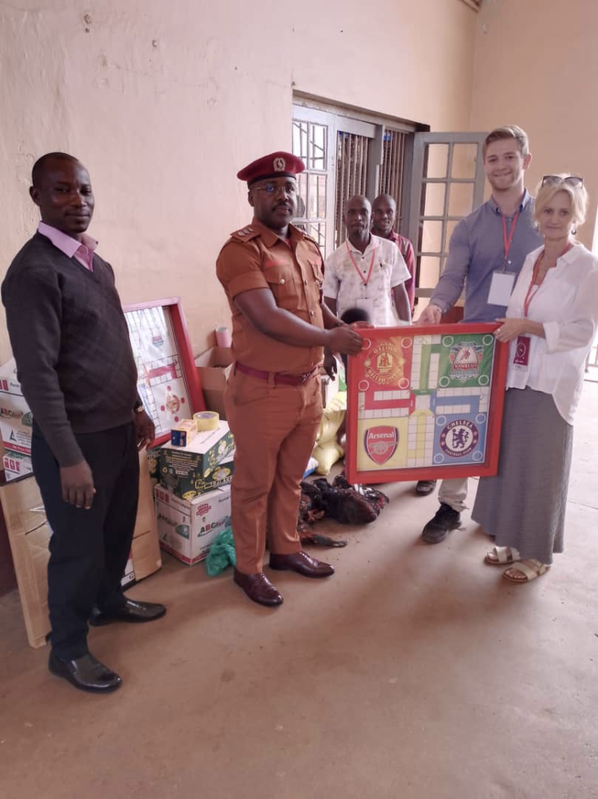

# Unsere Vision
Unsere Vision ist es, Menschen vollumfänglich Glauben, Hoffnung und Liebe zu schenken. Wir wollen Leben berühren, indem wir Gottes Liebe praktisch und geistlich weitergeben. Wir wollen Hoffnung bringen, wo Hoffnungslosigkeit ist, Ablehnung durch Annahme ersetzen, Freude statt Traurigkeit, Gemeinschaft statt Isolation, Licht statt Dunkelheit und den Frieden Gottes, den keiner sonst geben oder nehmen kann.

---

„Geht hinaus in die ganze Welt und verkündet das Evangelium der ganzen Schöpfung!“ ~ Markus 16,15

---

# Unsere Projekte

## 1. Familien mit behinderten Kindern im Mukono Distrikt

Im Mukono Distrikt gibt es viele Familien, die in absoluter Armut leben. Darunter gibt es auch einige mit behinderten Kindern, welche es besonders schwer haben. Charles ist als Einheimischer über die Jahre mit vielen dieser Familien in Kontakt gekommen.

Wir haben nun 9 Familien besucht, die wir in unser Programm aufgenommen und unterstützen wollen. Charles besucht sie vorerst 14-tägig, ermutigt sie, erzählt ihnen von Jesus, betet für sie und versorgt sie mit einem Nahrungspaket mit Tomaten, Karotten, Zwiebeln, Kohl, Bananen, Ananas, Maismehl und Bohnen, dazu Kochöl und Seife.

Da wir vor Ort noch nicht über ein eigenes Auto verfügen, müssen wir bei jedem Distriktbesuch eines mieten. Die momentanen finanziellen Möglichkeiten lassen es noch nicht zu, mehr Familien mit behinderten Kindern dazu zu nehmen. **Sobald sich regelmäßige Spender für diese 9 Kinder gefunden haben, werden wir den Kreis immer mehr erweitern.**

[→ Zu den Familienprofilen](1.%20Familien%20mit%20behinderten%20Kindern%20im%20Mukono%20Distrikt.html)

---

## 2. Good Samaritan Inclusive School

Charles ist seit vielen Jahren mit dem Direktor dieser Schule befreundet, die sich hauptsächlich um Kinder kümmert, die geistig und/oder körperlich behindert sind. Es gehen gesunde sowie beeinträchtigte Kinder zusammen in diese Schule und viele dieser Schulkinder wohnen auf dem Gelände.

Wir ermutigen und beten für die Kinder und die Leiter bei unseren Besuchen sowie Charles auch während unserer Abwesenheit. Da weitere Hilfsorganisationen an dieser Schule beteiligt sind – die beispielsweise monatlich die Schulgebühren unterstützen, die alten Schlafräume renoviert und einen neuen gebaut haben – haben wir beschlossen, uns auf die **Gesundheit der Kinder** zu konzentrieren und diesen Bereich zu unterstützen.

**Unsere Unterstützung umfasst:**
- Wöchentlicher Markteinkauf von frischem Obst und Gemüse (das Essen beschränkt sich sonst nur auf Maismehlbrei mit Bohnen)
- Regelmäßige medizinische Versorgung durch Spenden aus Deutschland mit Erste-Hilfe-Materialien
- Kauf spezifischer Medizin vor Ort (z.B. gegen Malaria, Würmer, Schmerzmittel)
- Kostengünstige Behandlung durch Dr. Daniel von der Shine-Now Clinic

Das Essen für die Kinder kann nicht durch Schulgelder finanziert werden, da nur wenige Eltern diese regelmäßig oder gar nicht bezahlen können. Durch unsere Hilfe versuchen wir, die Lebensqualität und Gesundheit der Kinder zu verbessern.

---

## 3. Shine-Now Clinic

Dr. Daniel arbeitet in einem der Staatskrankenhäuser und führt parallel seine eigene Klinik, die auf Frauenheilkunde spezialisiert ist. Viele Patientinnen können sich keine medizinische Hilfe vor und während der Geburt leisten und hoffen hier auf Hilfe.

Dr. Dan kämpft mit den wenigen Möglichkeiten, welche ihm zur Verfügung stehen, um jedes kleine Leben, welches zu früh oder unterernährt auf die Welt kommt. Auch viele schwangere Frauen haben ihr Leben ihm zu verdanken, wenn sie durch Kaiserschnitt entbunden durften, obwohl sie kein Geld hatten, um die Krankenhausrechnung zu bezahlen.

**Dr. Dan ist wiedergeborener Christ** und deswegen gibt es die moralische Regel dort, unter keinen Umständen eine Abtreibung zu praktizieren. Dazu behandelt er oder sein Team die Kinder von Good Samaritan als gemeinnützigen Dienst, als Dankeschön, dass wir ihn schrittweise mit Ausrüstung und Geräten versorgen.

**Unsere Unterstützung:**
- Bei jedem Besuch bringen wir einen Koffer mit gespendeten medizinischen Dingen: Blutdrucksensoren, Masken, Desinfektionsmitteln, Medizin, Verbandmaterialien und vieles andere

- Bei unseren Besuchen kaufen wir in Apotheken Medikamente, um die meist leeren Regale der Klinik wieder aufzufüllen

**Bereits finanzierte Ausrüstung:**
1. Sonar

2. Krankenbett

3. Chemie-Analyser
4. Vital Monitor (Dr Daniel im Bild)

5. Baby-Wärmer

**Dringend benötigt:** Ein Brutkasten, da viele Mütter mit Komplikationen in die Klinik kommen und viele Kinder viel zu früh auf die Welt kommen. Leider sterben einige Frühgeborene, da kein Brutkasten vorhanden ist.

---

## 4. Gefängnisdienst

Durch den Hauptpastor, Hannington, von Vision for Africa haben wir Zutritt zu mittlerweile **3 Gefängnissen** bekommen. Dies ist für uns ein ganz besonderer Segen und Gunst Gottes, da es nicht einfach ist, für diesen Dienst eine Genehmigung zu bekommen.

Dieser Dienst ist etwas ganz Besonderes. Jesus' Auftrag lautet, das Evangelium in die Gefängnisse zu bringen, und dies tun wir mit großer Freude. Wir lieben diese Menschen so, wie Jesus sie liebt. **Hunderte von Insassen durften wir zu Jesus führen** und sogar schon Zeugnisse von einem "Officer in Charge" hören, wie diese Insassen nach ihrer Entlassung ihm in der Freiheit wiederbegegnet sind und komplett verändert waren und nun ein neues Leben führen.

**Bei jedem Gefängnisbesuch bringen wir mit:**
- Bibeln
- Lebens- und hygienemittel
- Seife, Zahnbürsten, Toilettenpapier, Rasierklingen
- Das Evangelium

In **Kauga** durften wir schon einen Toilettenbau finanzieren, da man sonst nur in Plumsklos gehen konnte. Hier sind wir immer herzlich willkommen und ab 2026 hat Charles sogar offiziell die Erlaubnis, regelmäßig Jüngerschaftskurse mit den Gefangenen durchführen zu dürfen.

In **Nakifuma** brachten wir bei unserem letzten Besuch Spiele mit. Der Sozialleiter teilte uns mit, dass er den Gefangenen gerne Schreinern und Handarbeit beibringen möchte. Dies wollen wir bei unserem nächsten Besuch unterstützen und vor Ort Werkzeuge für sie besorgen.

### Todestrakt - Ein besonderer Dienst
Ganz besonders ist die Möglichkeit, zu den Todeskandidaten im Hochsicherheitsbereich des größten Gefängnisses des Landes zu sprechen. In Uganda gibt es noch die Todesstrafe, welche allerdings bei dem jetzigen Präsidenten nicht vollstreckt wird. Dennoch sind diese Menschen aufgrund von Schwerverbrechen bereits seit Jahrzehnten in diesem Todestrakt.

Hier versuchen wir ihnen ganz besonders zu zeigen, wie sehr Gott sie liebt und wie wertvoll sie sind. Bei einem unserer Besuche baten uns die Insassen im Anschluss um verschiedene Brettspiele und Preise, um einen Wettbewerb zu veranstalten:

Durch verschiedene Spenden konnten wir dies bei unserer letzten Reise ermöglichen. Begehrt waren Lebensmittel und auch lebendige Hühner.

---

## 5. Prothesen-Projekte

Es liegt uns am Herzen, Menschen vollumfänglich zu helfen: Geist, Seele und Körper.

Da das billigste Transportmittel in Uganda die Bodas (Motorrad-Taxis) sind, gibt es oft schwere Unfälle, welche leider oftmals im Verlust der Gliedmaßen enden. Aber auch einige Kinder kommen mit verformten oder fehlenden Körperteilen zur Welt.

Vor Ort gibt es eine deutsche Hilfsorganisation namens ProUganda, die sich genau diesen Patienten widmet und Prothesen anfertigt. Bei unseren Einsätzen lernen wir manchmal Leute kennen, denen man mithilfe einer Spende und der Zusammenarbeit mit dieser Hilfsorganisation ein neues Leben ermöglichen kann.

### Benifasiyo - 87 Jahre alt

Er lebt alleine in seiner Hütte mitten im Nirgendwo. Benifasiyo hatte vor 40 Jahren einen schweren Autounfall und lebte seitdem mit einer 10 kg schweren selbstgebastelten Holzprothese.

**Wir haben ihn im Februar 2025 kennengelernt und im September 2025 konnten wir seine Prothese und Behandlung vollumfänglich durch eine Spende finanzieren.**

### Bossa - 28 Jahre alt

Er ist Fliesenleger von Beruf. Doch beim Überqueren einer Straße wurde er von einem Boda (Motorrad) Fahrer angefahren und fiel vor einen LKW, der ihm über den Fuß fuhr. Sein gesamter Unterschenkel musste nach Monaten der Behandlung amputiert werden, da die Genesung zu kompliziert und kostspielig gewesen wäre.

**Nun könnte er mit einer Spende ein neues Bein bekommen und zu einem unabhängigen Alltag zurückkehren. Dies ist eines unserer Gebetsanliegen.**

---

## 6. Unterstützung von Charles

Charles ist unser treuer Freund und Mitarbeiter vor Ort. Er trägt die Mission weiter, auch wenn wir zurück in Deutschland sind.

**Seine Aufgaben:**
- Regelt alle Termine
- Erledigt die Markteinkäufe für die Kinder bei Good Samaritan und für die Familien in den Distrikten
- Organisiert die Transporte, um alles den Familien zukommen zu lassen
- Ist unser Sozialarbeiter vor Ort
- Seine Liebe für die Kinder ist unbeschreiblich

Momentan lebt er mit seiner schwangeren Frau Edith und seinen zwei Söhnen Elton und Ethan in 2 kleinen Zimmern, ohne Bad oder fließendem Wasser. In seiner kleinen Wohn-Küche hat er seit einem Jahr eine Hausgemeinde, in der die Menschen aus der Nachbarschaft ermutigt, gestärkt, gelehrt und geheilt werden und neues Leben in Jesus finden durften.

**Nun träumen wir alle von einem eigenen Zuhause für ihn und seine Familie.**

---

## 7. Coming Soon: School Outreaches

Ein Mitglied der Hausgemeinde von Charles ist Godfrey. Er arbeitet bei einer Organisation, die Schuleinsätze plant. Mit ihm wollen wir zukünftig auch zu weiteren Schulen gehen, den Kindern und Leitern dort dienen und das Evangelium verkünden.

---

# Unser Team

## Charles Malunda

Er stammt aus Uganda und ist unsere rechte Hand vor Ort. Nach seinem Studium im sozialen Bereich arbeitet er heute als engagierter Sozialarbeiter mit großem Herz und Berufung. Durch seinen Glauben, seine Treue und Zuverlässigkeit ist er eine große Stütze für unseren dortigen Dienst. Er plant und begleitet die Projekte vor Ort und sorgt dafür, dass die Arbeit auch während unserer Abwesenheit weitergeht und weiterwächst – und das alles in seiner Freizeit, abends und am Wochenende.

## Nicky Zumkeller

Sie ist verheiratet, Mutter von 3 Kindern und wohnt in Deutschland. Marco, der vor 3 Jahren zur Familie kam, ist seither als 4tes Kind ein fester Teil in der Familie sowie im Team.

Nicky ist Teil von Zeugniskultur und dient im Heilungs- und Befreiungsdienst. Ihr Mann Marc unterstützt die Arbeit im Hintergrund. Die Missionseinsätze in Uganda sind für sie ein Herzensanliegen. Sie erlebt immer wieder, wie Gott den Dienst segnet und Früchte sichtbar werden.

## Marco Jauss

Marco stammt ursprünglich aus Namibia, hat in Südafrika studiert und lebt seit ein paar Jahren in Deutschland. Beruflich arbeitet er als Ingenieur und ist Mitgründer des Missionsdienstes in Uganda. Zusammen mit Nicky leitet er auch einen Hauskreis von Strahlen der Freude in Zusammenarbeit mit Church on the Road und ist ebenfalls im Heilungs- und Befreiungsdienst aktiv.

---

"Wer aber die Güter der Welt hat und seinen Bruder in Not sieht und sein Herz vor ihm verschließt, wie bleibt die Liebe Gottes in ihm? Kinder, lasst uns nicht mit Wort und Zunge lieben, sondern mit Tat und Wahrheit." ~ 1. Johannes 3,17-18

---

# Wie Sie helfen können

**Werden Sie Teil unserer Mission:**
- Gebet für unsere Arbeit und die Menschen in Uganda
- Regelmäßige Patenschaft für eine Familie oder ein Projekt
- Einmalige Spenden für spezifische Bedürfnisse
- Teilen Sie unsere Geschichten und helfen Sie uns, mehr Menschen zu erreichen

**Jede Spende kommt direkt an - 100% Transparenz und 1:1 Verantwortlichkeit.**

---
